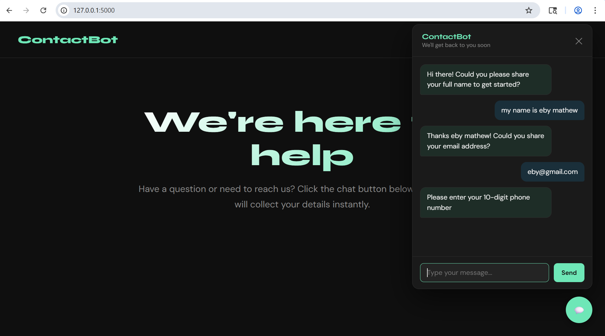
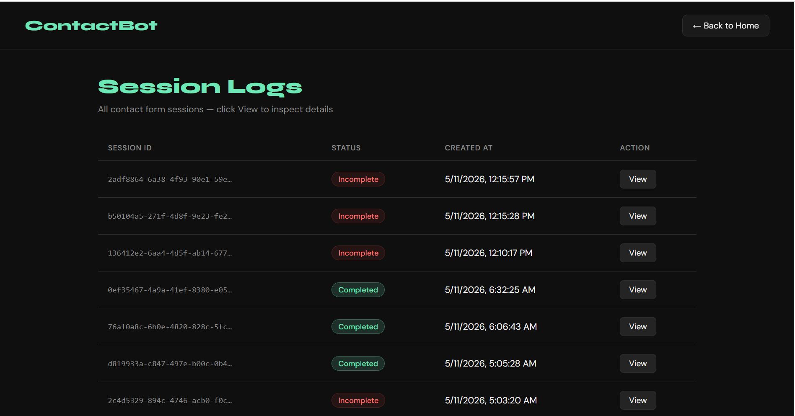

# ContactBot — AI-Powered Contact Form Chatbot

A conversational contact form chatbot built with LangGraph and Flask. Instead of a traditional static form, users chat with an AI bot that collects their name, email, phone number, and message through natural conversation — validating each field in real time.

---

## Demo

```
Bot: Hi there! Welcome! I'm here to help connect you with our team.
     Could you please share your full name?

User: John Doe

Bot: Thanks John! Could you share your email address?

User: john@gmail.com

Bot: Got it! Now could you share your 10-digit phone number?

User: 9876543210

Bot: Almost done! What message would you like to send to our team?

User: I need help with my order

Bot: Thank you John! We've received your message and our team
     will get back to you soon!
```

---

## Tech Stack

| Layer | Technology |
|-------|-----------|
| LLM | Groq API — `llama-3.1-8b-instant` |
| Agent Framework | LangGraph |
| LLM Tooling | LangChain + LangChain Groq |
| Validation | LangChain `@tool` decorator |
| Structured Output | Pydantic BaseModel |
| Backend | Flask |
| Database | SQLite |
| Checkpointing | LangGraph SqliteSaver |
| Logging | Python built-in `logging` module |
| Frontend | Plain HTML + CSS + JavaScript |

---

## Project Structure

```
contact-us-assignment/
├── app.py                  ← Flask server — entry point, run this file
├── graph.py                ← LangGraph graph assembly
├── llm.py                  ← Groq LLM initialisation (shared across all nodes)
├── state.py                ← ContactState TypedDict + Pydantic classes
├── tools.py                ← 3 validation @tool functions
├── database.py             ← All SQLite functions
├── logger.py               ← Python logging setup
├── nodes/
│   ├── __init__.py         ← Re-exports all nodes (keeps graph.py imports clean)
│   ├── ask_name.py
│   ├── validate_name.py
│   ├── ask_email.py
│   ├── validate_email.py
│   ├── ask_phone.py
│   ├── validate_phone.py
│   ├── ask_message.py
│   ├── validate_message.py
│   ├── save_to_db.py
│   └── edges.py            ← Conditional edge functions
├── .env                    ← API keys (never commit this)
├── contact.db              ← auto-created on first run
├── checkpoints.db          ← auto-created on first run (LangGraph checkpoints)
├── contact_logs.log        ← auto-created on first run
├── templates/
│   ├── index.html          ← Landing page with chat widget
│   └── logs.html           ← Admin logs page
└── static/
    ├── style.css           ← All styling
    └── script.js           ← All JavaScript
```

---

## Architecture

This project uses a **monolithic architecture** — Flask and LangGraph run in the same Python process. After every `invoke()` call, Flask saves all data directly to SQLite using database functions. No internal HTTP APIs needed.

```
Browser
   │
   ├── POST /chat/start ──▶ Save session → Run graph → Save greeting
   │
   ├── POST /chat ────────▶ Save user msg → Resume graph → Save bot reply
   │                                                      → Save error (if crash)
   │                                                      → Save contact (if done)
   │
   ├── GET  /logs ────────▶ Paginated sessions list
   └── GET  /logs/<id>/data ──▶ Conversation + errors + details (single request)
```

### LangGraph Flow

```
START
  ↓
askName → validateName ──invalid──▶ askName (retry)
                       ──valid───▶
                                   askEmail → validateEmail ──invalid──▶ askEmail (retry)
                                                            ──valid───▶
                                                                        askPhone → validatePhone ──invalid──▶ askPhone (retry)
                                                                                                ──valid───▶
                                                                                                            askMessage → validateMessage ──invalid──▶ askMessage (retry)
                                                                                                                                         ──valid───▶
                                                                                                                                                     saveToDB → END
```

### Database Tables

| Table | Purpose |
|-------|---------|
| `sessions` | Every chat session — status Incomplete/Completed |
| `chats` | Every message — bot and user |
| `contacts` | Final submitted form data |
| `errors` | System crashes from LangGraph nodes |

---

## Setup

### 1. Clone the repository

```bash
git clone <your-repo-url>
cd contact-us-assignment
```

### 2. Create virtual environment

```bash
python -m venv venv

# Windows
venv\Scripts\activate

# Mac/Linux
source venv/bin/activate
```

### 3. Install dependencies

```bash
pip install langgraph langchain langchain-groq langchain-core pydantic flask langgraph-checkpoint-sqlite python-dotenv
```

### 4. Get Groq API Key

1. Go to [https://console.groq.com](https://console.groq.com)
2. Sign up and create an API key
3. Copy the key

### 5. Create .env file

```
GROQ_API_KEY=your_api_key_here
```

### 6. Run the app

```bash
python app.py
```

Open your browser and go to:
```
http://127.0.0.1:5000
```

---

## Pages

### Landing Page — `http://127.0.0.1:5000`
Company home page with a floating chat button. Click the chat icon to open the bot and start the conversation.

### Admin Logs — `http://127.0.0.1:5000/logs-page`
Paginated table of all sessions. Click **View** on any session to open a popup with 3 tabs:
- **Conversation** — full chat history
- **Errors** — any system crashes during that session
- **Details** — final submitted contact data

---

## API Endpoints

| Method | Endpoint | Description |
|--------|----------|-------------|
| `POST` | `/chat/start` | Start a new session, get greeting |
| `POST` | `/chat` | Send a message, get bot reply |
| `GET` | `/logs` | Paginated sessions list |
| `GET` | `/logs/<session_id>/data` | Conversation, errors, and details in one response |

---

## Validation Rules

| Field | Rules |
|-------|-------|
| Name | Letters and spaces only, at least 2 words, no numbers or symbols |
| Email | Must have `@`, valid domain with a dot, at least one letter before `@` |
| Phone | Exactly 10 digits, numbers only, no leading zero, no repeated digits |
| Message | Minimum 10 characters, maximum 1000 characters |

---

## Key Design Decisions

**Why LangGraph?**
Multi-turn conversation with state persistence between messages. `interrupt_before` pauses the graph waiting for user input. `SqliteSaver` stores checkpoints so conversations survive server restarts.

**Why Groq?**
Fast inference, free tier available, no local model setup needed.

**Why split nodes into a folder?**
Each node lives in its own file (`ask_name.py`, `validate_email.py`, etc.), making the codebase easier to navigate and maintain. `nodes/__init__.py` re-exports everything so `graph.py` imports remain unchanged.

**Why a shared `llm.py`?**
The LLM instance is initialised once and imported by every node file that needs it. This avoids creating multiple Groq clients and makes it easy to swap the model in one place.

**Why combine the three session GET endpoints into one?**
The admin popup always shows all three tabs (conversation, errors, details) for a session. Fetching everything in a single `GET /logs/<session_id>/data` call is faster and avoids redundant network requests when the user switches tabs.

**Why monolithic architecture?**
Flask and LangGraph run together in one process. Simpler codebase, fewer files, direct database access. Suitable for learning and small-to-medium production deployments.

**Why SqliteSaver over MemorySaver?**
`MemorySaver` loses all conversation state on server restart. `SqliteSaver` persists checkpoints to `checkpoints.db` on disk — conversations survive restarts without needing PostgreSQL.

---

## Environment Variables

| Variable | Required | Description |
|----------|----------|-------------|
| `GROQ_API_KEY` | ✅ Yes | Your Groq API key from console.groq.com |

---

## .gitignore

Make sure these are in your `.gitignore`:

```
.env
contact.db
checkpoints.db
contact_logs.log
venv/
__pycache__/
*.pyc
```

---


## Screenshots

### Chat Widget


### Logs Dashboard


## License

This project is for educational purposes.